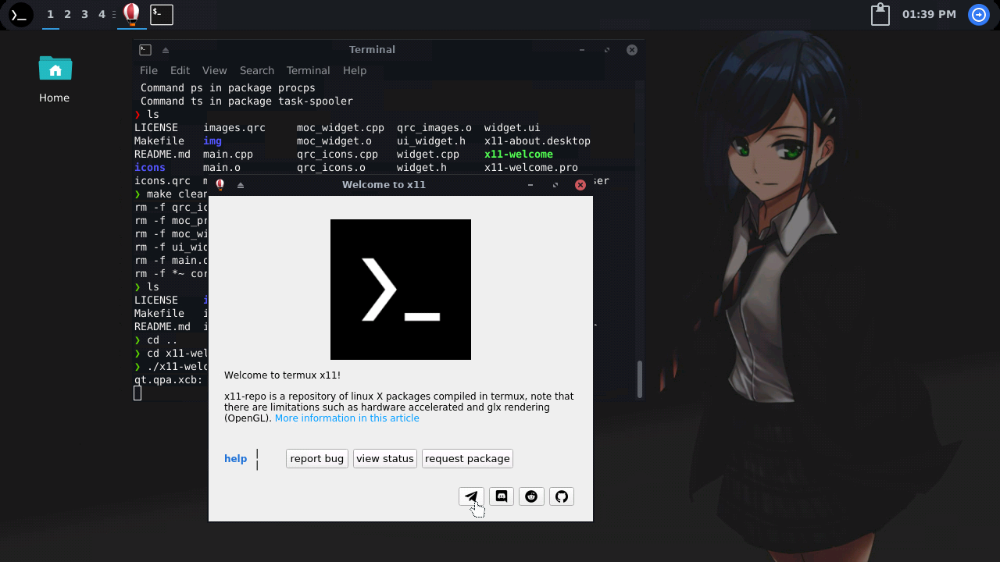

# x11-welcome
A simple welcome app for x11 written in Qt

 

x11-welcome is an (unofficial) application with a simple description and links to groups and help from termux x11 

This application for the moment I made for my project
termux-desktop-xfce, to provide a welcome message 

### Requirements for compilation

- clang
- qt5-qttools
- qt5-qtbase >= 5.10 

```bash
pkg update
pkg install clang qt5-qttools qt5-qtbase
```

### Compilation

```bash
git clone https://github.com/Yisus7u7/x11-welcome

cd x11-welcome

qmake x11-welcome.pro

make
```

And run

```
./x11-welcome
```
